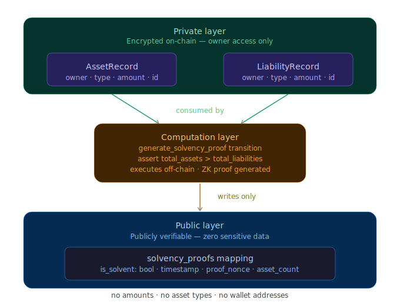

# VeritasZK

[](https://www.npmjs.com/package/veritaszk-sdk)
 — Prove Solvency. Reveal Nothing.

> The first zero-knowledge solvency proof system on Aleo.  
> Organizations prove they hold more than they owe — without revealing a single number.

**Live Demo:** https://veritaszk.vercel.app  
**Network:** Aleo Testnet  
**Contract:** `veritaszk.aleo`  
**Buildathon:** 

---

## The Problem

After FTX, Celsius, and BlockFi collapsed, crypto realized it had 
no reliable way to verify organizational solvency — without full 
public disclosure.

Current Proof-of-Reserves implementations (Binance, OKX) use 
Merkle trees that require publishing every wallet address and 
balance. That leaks treasury strategy, trading positions, and 
competitive intelligence. It forces a choice between 
**privacy** and **verifiability**.

VeritasZK eliminates that tradeoff.

---

## The Solution

VeritasZK lets DAOs, crypto funds, exchanges, and organizations 
prove they are solvent — assets exceed liabilities — via ZK proof 
on Aleo, without revealing:

- Which assets they hold
- Exact amounts per asset  
- Wallet addresses or identities
- Treasury strategy or trading positions

Anyone can verify the proof publicly. Nobody sees the underlying 
data. Ever.

---

## How It Works

### Three User Roles

| Role | What They Do |
|------|-------------|
| **Organization** | Declares private assets + liabilities, generates solvency proof |
| **Verifier** | Enters any org address, sees SOLVENT / UNVERIFIED / REVOKED |
| **Public** | Views dashboard of all registered orgs — zero financial data visible |

### The Privacy Model

| Data | Visibility | How |
|------|-----------|-----|
| Asset amounts | 🔒 Private | Stored in Leo Records — encrypted on-chain, owner only |
| Liability amounts | 🔒 Private | Stored in Leo Records — encrypted on-chain, owner only |
| Asset types | 🔒 Private | Inside Records — never touches public state |
| Wallet addresses | 🔒 Private | Never stored in any mapping |
| Solvency result | ✅ Public | Boolean only — `is_solvent: bool` |
| Proof timestamp | ✅ Public | When the proof was generated |
| Proof nonce | ✅ Public | Cryptographic commitment — not reversible |
| Org name | ✅ Public | Hashed before submission — raw name never on-chain |

**What the verifier sees:** SOLVENT ✓ or not. Nothing else.  
**What appears in any transaction:** A boolean. A timestamp. A hash.  
**What appears in any mapping:** The same.

This is not privacy by obscurity. The proof is cryptographically 
verified by Aleo's ZK proof system. The witnesses are 
mathematically hidden.

---

## Why Only Aleo Makes This Possible

| Chain | Private State | Public Verifiability | Verdict |
|-------|-------------|---------------------|---------|
| Ethereum | ❌ All state public | ✅ | Impossible |
| Aztec | ✅ | ⚠️ Limited | No clean L1 impl |
| Solana | ❌ | ✅ | Impossible |
| **Aleo** | ✅ Native Records | ✅ Public Mappings | **Purpose-built** |

Aleo's private Records are first-class citizens — not bolt-ons. 
Off-chain execution computes the proof privately before 
submission. The finalize block receives only the result. 
This is exactly what Aleo was designed for.

---

## Architecture
```
┌─────────────────────────────────────────────────────┐
│                   PRIVATE LAYER                      │
│  AssetRecord { owner, asset_type, amount, id }      │
│  LiabilityRecord { owner, liability_type, amount }  │
│  → Encrypted on-chain. Owner-only access.           │
└─────────────────┬───────────────────────────────────┘
                  │ consumed by
┌─────────────────▼───────────────────────────────────┐
│              COMPUTATION LAYER                       │
│  generate_solvency_proof transition                 │
│  → Sums assets. Sums liabilities.                   │
│  → Asserts: total_assets > total_liabilities        │
│  → Computes proof_nonce via BHP256 hash             │
│  → Executes OFF-CHAIN (Aleo native)                 │
└─────────────────┬───────────────────────────────────┘
                  │ writes only
┌─────────────────▼───────────────────────────────────┐
│                PUBLIC LAYER                          │
│  solvency_proofs mapping:                           │
│  address → { is_solvent: bool, timestamp,           │
│              proof_nonce, asset_count }             │
│  → No amounts. No identities. Publicly verifiable.  │
└─────────────────────────────────────────────────────┘
```



### Contract

**Program:** `veritaszk.aleo`  
**Network:** Aleo Testnet  
**Transaction:** `at1tkmfhd76ggsrx7p0srlhfc6hyjsqefskrtwd49y3elk4dga4sczse6r5c4`  
**Explorer:** [View on Provable Explorer](https://testnet.explorer.provable.com/transaction/at1tkmfhd76ggsrx7p0srlhfc6hyjsqefskrtwd49y3elk4dga4sczse6r5c4)

Deployed using Leo built from source (commit e773034) against snarkVM 4.6.0
— the first community deployment after the ConsensusVersion V14 upgrade.

## Changelog

**Initial release:**
- ✅ Complete Leo smart contract — 6 transitions, full privacy model
- ✅ Organization portal — private asset/liability declaration + proof generation
- ✅ Verifier portal — public solvency verification, shareable deep-links
- ✅ Public dashboard — org registry with live proof status
- ✅ ZK proof animation — full-screen generation sequence with matrix rain + particle burst
- ✅ Wallet integration — Leo Wallet + Puzzle Wallet
- ✅ Multi-token support: credits.aleo, USDCx, USAD
- ✅ Simulation mode — full demo journey works without testnet dependency
- ✅ Deployed: https://veritaszk.vercel.app
- ✅ Contract live on Aleo Testnet: `at1tkmfhd76ggsrx7p0srlhfc6hyjsqefskrtwd49y3elk4dga4sczse6r5c4`

---

## Roadmap

- **Multi-wallet proof aggregation** — prove solvency across multiple Aleo addresses in a single unified proof
- **Time-locked proof expiry** — proofs auto-invalidate after a configurable number of blocks, ensuring freshness
- **Selective disclosure** — reveal specific asset types to specific verifier addresses via private record transfer, enabling compliance workflows without full disclosure
- **veritaszk-sdk v0.2.0** — batch verification, webhook support, React hooks package (`use-veritaszk`)
- **Verification API** — REST endpoint for organizations to embed real-time solvency status in their own dashboards
- **Proof history timeline** — on-chain audit trail of all proof generations and revocations per organization


---

*VeritasZK — Prove Solvency. Reveal Nothing.*
